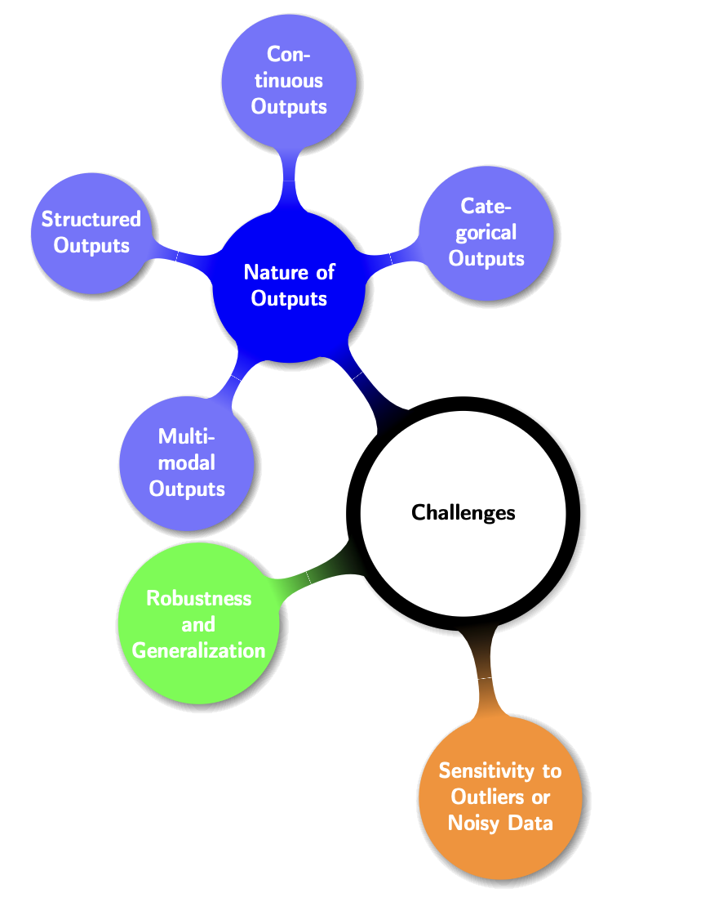
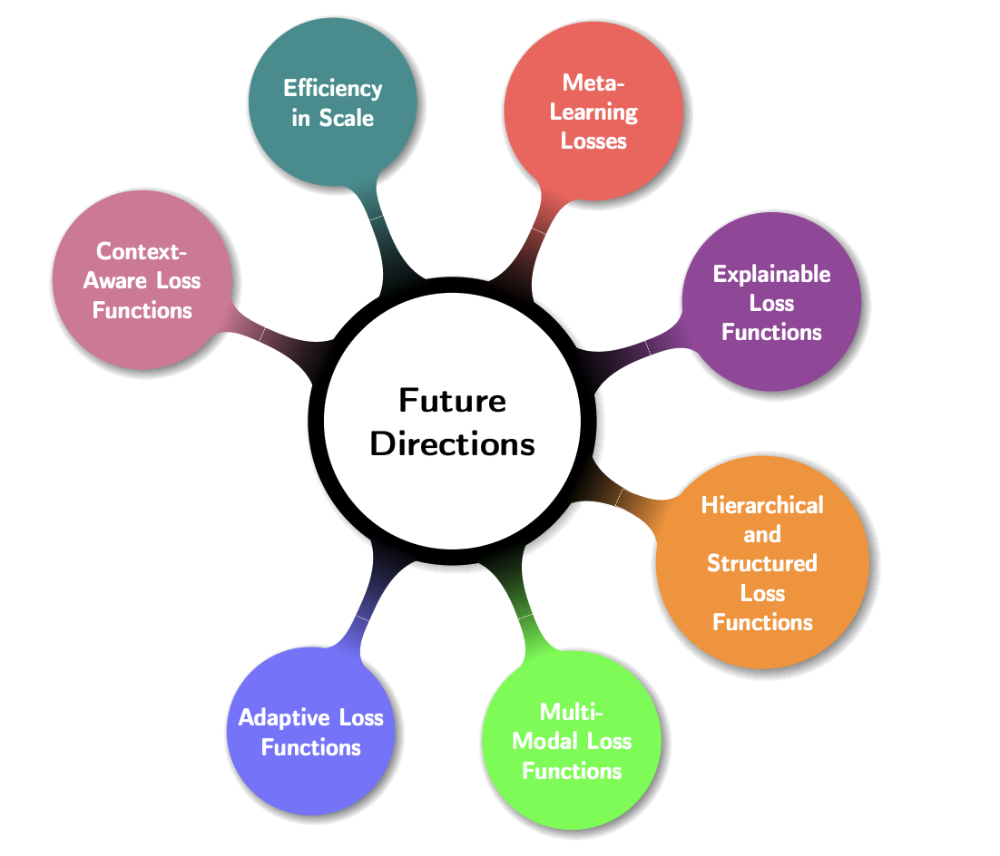

# **Benefits, Challenges, and Future Directions**

## **1. Benefits and Limitations**

Loss functions form the foundation of optimization in image generation and related computer vision tasks. Each function introduces unique advantages that make it particularly effective for certain contexts, but also brings challenges that must be carefully managed.

### **Benefits**

Several loss functions have proven particularly effective across classification, segmentation, and generation tasks:

* **Cross-Entropy Loss and Variants**

  * *Strengths:* Widely used in classification due to its probabilistic interpretation, stability, and ease of implementation.
  * *Extensions:* **Binary Cross-Entropy** works well for binary decisions, while **Categorical Cross-Entropy** generalizes to multi-class problems. **Weighted Cross-Entropy** further enhances performance by mitigating class imbalance, ensuring underrepresented classes receive sufficient importance.

* **Pixel-wise Softmax with Cross-Entropy**

  * Effective in semantic segmentation, as it preserves spatial context and drives high pixel-level accuracy across complex images.

* **L1 Loss (Mean Absolute Error)**

  * Robust against outliers, as it minimizes the influence of extreme values on training.

* **Dice Loss**

  * Specially tailored for imbalanced datasets. By focusing on overlap, it ensures stronger alignment between predicted masks and ground truth.

* **Focal Loss**

  * Highly effective in handling skewed class distributions by down-weighting easy examples and emphasizing hard-to-classify ones.

* **Adversarial Loss**

  * Core to GANs, it enhances realism by forcing models to mimic true data distributions, producing sharp and natural-looking outputs.

* **Perceptual Loss**

  * Goes beyond pixel-level accuracy, aligning high-level feature representations to produce perceptually pleasing images.

* **Variational Autoencoder (VAE) Loss**

  * Provides a probabilistic foundation for generative modeling, encouraging diversity in generated samples while maintaining latent structure.

### **Limitations**

Despite their benefits, loss functions often come with trade-offs that affect stability, scalability, or ease of use:

* **Cross-Entropy and Variants (BCE, CCE, Weighted)**

  * Sensitive to class imbalance, potentially leading to overconfident or biased predictions. Weighted variants mitigate this but require careful balancing.

* **Pixel-wise Softmax with Cross-Entropy**

  * Computationally heavy, especially for large-scale images or datasets, making it less practical for resource-constrained environments.

* **L1 Loss**

  * Though robust, it can produce slower convergence and less smooth optimization paths compared to MSE.

* **Dice Loss**

  * Suffers from unstable or complex gradient behavior near class boundaries, which can make training difficult.

* **Focal Loss**

  * More computationally demanding than Cross-Entropy and requires tuning of hyperparameters ($`\alpha, \gamma`$), making implementation less straightforward.

* **Jaccard (IoU) Loss**

  * Computationally expensive due to overlap calculations, limiting its use in real-time applications.

* **Adversarial Loss**

  * Training instability is a major drawback, as GANs require simultaneous optimization of generator and discriminator. This often leads to issues like mode collapse.

* **Perceptual Loss**

  * Relies on deep feature extractors (e.g., pretrained CNNs), making it computationally intensive and slower than pixel-based losses.

* **VAE Loss**

  * Difficult to balance between **reconstruction error** and **KL divergence**. Poor tuning can lead to either blurry reconstructions or uninformative latent spaces.

### **Key Insight**

The **choice of loss function** must always balance **benefits** (robustness, interpretability, perceptual fidelity) against **limitations** (computational cost, instability, sensitivity to imbalance). No single function is universally optimal—selection must align with **task requirements**, **data characteristics**, and **computational constraints**.

---

## **Advantages and Disadvantages of Common Loss Functions**

| **Loss Function**                              | **Advantages**                                                                                      | **Disadvantages**                                                                                  |
| ---------------------------------------------- | --------------------------------------------------------------------------------------------------- | -------------------------------------------------------------------------------------------------- |
| **Cross-Entropy Loss**                         | Effective in multi-class classification; Provides probabilistic interpretations; Easy to implement. | Sensitive to class imbalance; Can lead to overconfidence in predictions.                           |
| **Binary Cross-Entropy Loss**                  | Simple and efficient for binary classification; Provides clear probabilistic outputs.               | Assumes outputs are independent; May not perform well with correlated data.                        |
| **Weighted Cross-Entropy Loss**                | Helps mitigate class imbalance; Adjusts the importance of classes.                                  | Requires careful tuning of weights; Increased computational overhead.                              |
| **Pixel-wise Softmax with Cross-Entropy Loss** | Effective for segmentation tasks; Maintains spatial context.                                        | High computational and memory requirements; Complex gradients.                                     |
| **L1 Loss**                                    | Robust to outliers; Minimizes extreme values’ impact.                                               | Can lead to less smooth convergence during optimization.                                           |
| **Dice Loss**                                  | Well-suited for imbalanced datasets; Focuses on overlap rather than pixel-wise accuracy.            | Gradients can be complex near boundaries; Harder to optimize.                                      |
| **Focal Loss**                                 | Addresses class imbalance by down-weighting easy examples.                                          | More computationally demanding than standard cross-entropy; Requires tuning of focusing parameter. |
| **Jaccard Loss**                               | Directly optimizes overlap measures; Ideal for segmentation tasks.                                  | Computationally intensive; Complex gradient calculations.                                          |
| **Adversarial Loss**                           | Enhances realism in generated images; Models distribution well.                                     | Requires simultaneous training of generator and discriminator; Can lead to instability.            |
| **Categorical Cross-Entropy Loss**             | Works well for multi-class problems; Provides probabilistic outputs.                                | Class imbalance issues observed; Similar limitations to standard cross-entropy.                    |
| **Contrastive Loss**                           | Effective for learning similarities and differences between pairs.                                  | Requires careful curation of pairs; Increases implementation complexity.                           |
| **Diffusion Noise Prediction Loss**            | Useful in modern generative models; Handles noise explicitly.                                       | High computational burden; Model complexities can complicate training.                             |
| **Perceptual Loss**                            | Captures perceptual differences; Leads to visually appealing results.                               | Computationally expensive due to feature extraction; May require significant model adjustments.    |
| **Variational Autoencoder (VAE) Loss**         | Provides a probabilistic framework for generative models.                                           | Balancing reconstruction and KL divergence is tricky; Requires careful parameter tuning.           |

---

## **2. Challenges in Selecting Loss Functions**

Selecting the right loss function is a **critical determinant of deep learning performance** across tasks such as regression, classification, segmentation, and generative modeling. While loss functions serve the unified purpose of quantifying prediction errors and guiding optimization, their **choice is rarely straightforward** due to diverse task requirements, data characteristics, and computational constraints. Below, we outline the key challenges encountered in aligning loss functions with real-world computer vision and generative modeling tasks.

### **1. Appropriateness for the Nature of Outputs**

One major challenge is ensuring that the loss function appropriately reflects the nature of the output. For example, in regression tasks where the goal is to predict continuous values, `Mean Squared Error (MSE)` is commonly used, where as for classification tasks, `Cross-Entropy` Loss is preferred. However the situation becomes complex when dealing with `multi-label` classification or `semantic segmentation`, where standard loss functions might not capture the nuances of class imbalance or intricate relationships between outputs, requiring custom loss formulations or weighting schemes.

In image segmentation, the primary challenge is handling class imbalances where certain classes may dominate
the image, leading traditional loss functions like `Cross-Entropy` to perform poorly. To address this, variations such as `Weighted Cross-Entropy` or `Dice Loss` are often used to ensure that each class is appropriately considered during the training process. Dice Loss, in particular, is effective because it directly maximizes the overlap between predicted and true segments, which is crucial for applications like medical imaging where precise boundaries are critical.

* **Nature of Outputs**: The nature of the outputs varies widely across different tasks - ranging from discrete class labels in classification tasks to continuous pixel values in image generation. For each of these different types of outputs, the choice of loss function must be tailored to effectively capture the nauances of the task at hand.

* **Categorical Outputs**: Classification tasks often employ `Cross-Entropy` Loss, which works well for discrete labels. However, in **imbalanced datasets**, it may bias predictions toward majority classes. `Weighted Cross-Entropy` or `Focal Loss` are introduced to address this imbalance but add tuning complexity.

* **Continuous Outputs**: Regression and image generation typically rely on `Mean Squared Error` (MSE). Yet, MSE disproportionately penalizes large errors, making it sensitive to outliers. Alternatives such as **Huber Loss** or **Log-Cosh Loss** balance sensitivity, ensuring smoother convergence.

* **Structured Outputs**: Tasks like **semantic segmentation** and **object detection** require spatially structured predictions(i.e., pixel-wise predictions). Loss functions need to account for the spatial dependencies and relationships among predicted pixels. Overlap-based metrics like **Dice Loss** or **IoU Loss** are more effective than Cross-Entropy alone, as they directly maximize region overlap between predicted and ground-truth masks.

* **Multi-modal Outputs**: In cross-domain tasks (e.g., text-to-image or audio-to-image generation), composite losses are needed to bridge diverse modalities. These often combine `perceptual losses`, `adversarial losses`, and `embedding alignment losses` (e.g., text-image matching), ensuring semantic fidelity and realism.

* **Robustness and Generalization**: A critical consideration is ensuring that the loss fucntion remains robust to various forms of noise and outliers within the data. The loss function should capture not only the most common cases but also accomodate variability and enure generalization to unseen data distributions. Techniques such as `Data Augmentation`, and the use of `regulaized loss functions` can help improve robustness.

In summary, aligning the loss function with the characteristics of the output is a significant challenge that influences model performance across various deep learning tasks. The selection of an appropraite loss function is crucial for effectively capturing the underlying relationships in the data, accommodating imbalances, and ensuring robustness to noise and outliers. Continuous research is needed to develop more sophiscated loss functions that can adapt to the evolving complexities of deep learning applications.

### **2. Sensitivity to Outliers or Noisy Data**

One of the recurring challenges in designing or selecting loss functions is their **sensitivity to outliers and noisy data**. Outliers can disproportionately influence optimization, while noisy data can mislead models into learning spurious patterns rather than the underlying distribution. This sensitivity can compromise both **generalization ability** and **training stability**, making robustness a central concern in modern deep learning.

#### **1. The Impact of Outliers**

* **Mean Squared Error (MSE)** is one of the most commonly used loss functions for regression. However, because it **squares the error term**, a single large deviation (outlier) can dominate the overall loss, biasing parameter updates toward that error and leading to poor generalization.
* To mitigate this issue, more robust alternatives have been introduced:

  * **Huber Loss**: Quadratic for small errors (like MSE) but linear for large errors (like MAE), striking a balance between sensitivity and robustness.
  * **Quantile Loss**: Useful in probabilistic forecasting and regression tasks, capturing prediction intervals while reducing sensitivity to extreme values.

#### **2. Noisy Labels in Structured Outputs**

* In **semantic segmentation**, mislabeled pixels act as noise that can degrade performance. Loss functions like standard **Cross-Entropy** may overfit to these errors, skewing predictions.
* Techniques to counteract noisy labels include:

  * **Label smoothing**, which softens target labels and prevents the model from becoming overly confident in incorrect labels.
  * **Overlap-based losses** (e.g., Dice Loss, IoU Loss), which emphasize spatial overlap rather than pixel-level accuracy, providing more robustness against localized noise.

#### **3. Noisy Data in Generative Models**

* **Adversarial models (GANs)** are particularly vulnerable to noise in training data. If the discriminator is exposed to noisy samples, it may propagate misleading signals, causing the generator to produce artifacts.
* Robust strategies include:

  * **Regularization methods** (e.g., gradient penalties, spectral normalization) that stabilize adversarial training.
  * **Wasserstein Loss**, which provides smoother gradients and greater stability in the presence of outliers compared to standard adversarial loss functions.

#### **4. Multi-Modal Tasks**

* In **multi-modal learning** (e.g., text-to-image or audio-visual tasks), noise in one modality (e.g., corrupted text labels or low-quality audio) can disrupt alignment with other modalities.
* Robustness strategies include:

  * **Curriculum learning**, where the model is first trained on simpler, cleaner examples and then gradually exposed to noisier, complex inputs.
  * **Composite loss functions**, which combine reconstruction, perceptual, and adversarial terms to reduce reliance on any single noisy modality.

#### **5. Mitigation Strategies**

To reduce the negative impact of noise and outliers, practitioners often employ a combination of **robust loss functions** and **data preprocessing techniques**:

* **Robust Losses**: Huber Loss, Log-Cosh Loss, and Wasserstein Loss provide resilience to outliers.
* **Data Augmentation**: Enhances generalization by exposing the model to a variety of variations, reducing sensitivity to noise.
* **Outlier Detection & Filtering**: Removing or down-weighting anomalous samples prior to training.
* **Regularization**: Adding penalties or constraints to model weights to prevent overfitting to noise.

Understanding and addressing the sensitivity of loss functions to outliers and noisy data is **essential for building robust machine learning systems**. By carefully selecting loss functions and integrating noise-mitigation techniques, models can achieve:

* **Improved generalization** across unseen datasets,
* **Greater stability** in optimization, and
* **Enhanced resilience** in real-world scenarios where data is rarely clean.

### **3. Interpretability and Scalability of Loss Functions**

Loss functions in deep learning face two significant challenges: **interpretability** (how well the loss represents model quality in a human-understandable way) and **scalability** (how effectively the loss can be applied as models and datasets grow in size and complexity). These challenges are especially relevant in **adversarial training**, **reinforcement learning**, and **multi-modal tasks**, where objectives are more complex than standard classification or regression.

#### **1. Adversarial Training**

* In **Generative Adversarial Networks (GANs)**, the adversarial loss measures how well the generator fools the discriminator, rather than directly evaluating image quality.
* This creates **interpretability issues**, since a lower loss doesn’t necessarily mean perceptually better images.
* **Scalability challenges** arise as datasets and architectures grow, requiring strategies such as **progressive growth of GANs** to manage computational demands efficiently \[179].

#### **2. Reinforcement Learning**

* Loss functions are tied to **reward signals**, which must accurately reflect long-term benefits of actions.
* Crafting these reward-based losses is difficult: they must be interpretable (capturing true task goals) and scalable to long horizons and dynamic environments.
* Poorly designed losses can destabilize training or encourage unintended behaviors.

#### **3. Semantic Segmentation**

* Commonly used loss functions include **Cross-Entropy Loss** and **Dice Loss**, both of which aim to capture pixel-level accuracy.
* As the **number of classes** or **image resolution** increases, scalability becomes a bottleneck.
* Solutions:

  * **Class weighting** to balance representation.
  * **Adaptive sampling** to reduce computational burden \[178].

#### **4. Multi-Modal and Cross-Domain Tasks**

* Tasks like **text-to-image generation** or **audio-visual learning** require loss functions that capture **semantic alignment** across modalities.
* Composite losses (e.g., combining **Perceptual Loss**, **Matching-aware Loss**, and standard reconstruction objectives) are often needed.
* As task complexity grows, scalability becomes more pressing:

  * **Transformers** have shown promise in scaling multi-modal tasks effectively \[180].

#### **5. Emerging Challenges**

* **High-dimensional audio + high-resolution images**: Requires robust preprocessing and efficient loss formulations to avoid computational bottlenecks \[181].
* **Interpretability gaps**: Complex composite losses often don’t directly align with human intuition, making evaluation harder.
* **Scalability demands**: Larger models and datasets require innovative strategies for computational efficiency without losing loss-function effectiveness.

* **Interpretability**: Many advanced loss functions (adversarial, composite, multi-modal) do not directly align with human-understandable metrics of quality.
* **Scalability**: Increasing dataset size, resolution, and model complexity demand efficient designs and hybrid approaches.
* **Path forward**: Development of **hybrid models** and **innovative loss functions** that balance multi-modal interpretability with computational efficiency remains a key research direction.

### **Summary**

The major challenges in loss function design can be summarized as:

1. **Appropriateness for Outputs** – tailoring the loss to categorical, continuous, structured, or multi-modal data.
2. **Sensitivity to Outliers/Noise** – ensuring robustness against anomalous data points and mislabeled samples.
3. **Interpretability and Scalability** – balancing computational feasibility with meaningful optimization signals in increasingly complex tasks.

Addressing these challenges requires **innovative composite loss formulations**, integration of robustness strategies, and efficient implementations, making loss function design an ongoing area of active research in deep learning.

---

## **3. Future Directions of Loss Functions in Deep Learning**

The design of loss functions remains one of the most critical areas of research in deep learning, as they directly influence learning dynamics, robustness, and generalization. With the growing complexity of tasks across computer vision, natural language processing, reinforcement learning, and multi-modal AI, future developments in loss functions will focus on enhancing **robustness, interpretability, adaptability, and scalability**.

As represented in the figure below, the following directions outline promising pathways for advancing loss function research:

### **1. Adaptive Loss Functions**

* Future loss functions should **dynamically adjust** based on the data distribution, class imbalance, or the presence of outliers.
* Example: An adaptive function could reduce sensitivity to noisy data points during training while emphasizing hard or rare examples.
* **Benefit**: Improved real-world performance where datasets often contain irregularities and mislabeled samples.

### **2. Robustness to Adversarial Attacks**

* With adversarial examples posing a significant risk, loss functions may integrate mechanisms to resist **adversarial perturbations**.
* This could include embedding adversarial loss components or explicitly penalizing sensitivity to small but malicious input variations.
* **Goal**: Enhance security and stability of deep learning systems in critical applications (e.g., finance, healthcare, autonomous driving).

### **3. Unified Frameworks for Multi-Modal Learning**

* Increasingly, AI systems must work with **multiple modalities** (e.g., text, image, audio, video).
* Future loss functions could provide **composite objectives** that capture cross-modal relationships (e.g., text-to-image alignment, audio-to-visual translation).
* **Outcome**: Better generalization in cross-domain tasks like text-to-image generation, audio-visual speech recognition, and multi-sensory robotics.

### **4. Loss Functions for Hierarchical Outputs**

* Tasks such as **semantic segmentation** and **structured image generation** require outputs that maintain **spatial and contextual coherence**.
* Hierarchical loss functions could explicitly model relationships across different structural levels (e.g., pixels → regions → objects).
* **Impact**: Improved quality in structured prediction tasks (medical imaging, 3D scene generation).

### **5. Interpretable Loss Structures**

* As **explainability** becomes crucial in AI, future loss functions may include interpretable components that **clarify what aspects of predictions are rewarded or penalized**.
* Example: A segmentation loss that separately reports penalties for boundary misalignments vs. class misclassification.
* **Advantage**: Builds trust in AI systems for high-stakes environments (law, medicine, finance).

### **6. Meta-Learning Approaches**

* Loss functions may be designed to **learn how to adjust themselves** depending on the dataset and training context.
* By leveraging meta-learning, the loss itself becomes **task-adaptive**, improving model generalization across diverse tasks.
* **Benefit**: Reduces the burden of manually selecting or tuning loss functions for every problem.

### **7. Scalable Loss Functions**

* With the growth of datasets and model architectures (e.g., GPT, large ViTs), future loss functions need to be **computationally efficient**.
* Potential solutions:

  * Approximate loss computations.
  * Hierarchical loss decomposition for distributed training.
* **Impact**: Maintains effectiveness while lowering memory and compute requirements for large-scale models.

### **8. Incorporating Contextual Information**

* Loss functions could be designed to leverage **context within data** (e.g., temporal dependencies in time series, semantic relationships in NLP).
* Example: A forecasting loss that penalizes trend deviation more heavily than noise deviation.
* **Advantage**: Encourages models to focus on **meaningful patterns** rather than superficial correlations.

### **Conclusion**

The future of loss function research will emphasize:

* **Robustness**: Handling noise, outliers, and adversarial threats.
* **Adaptability**: Automatically adjusting to task and dataset characteristics.
* **Interpretability**: Providing clear, human-understandable signals.
* **Scalability**: Supporting massive datasets and architectures.
* **Multi-modality**: Aligning across diverse data types.

By innovating along these dimensions, future loss functions will not only improve model training but also enable the development of **explainable, efficient, and versatile AI systems** that align more closely with real-world complexities.

---

