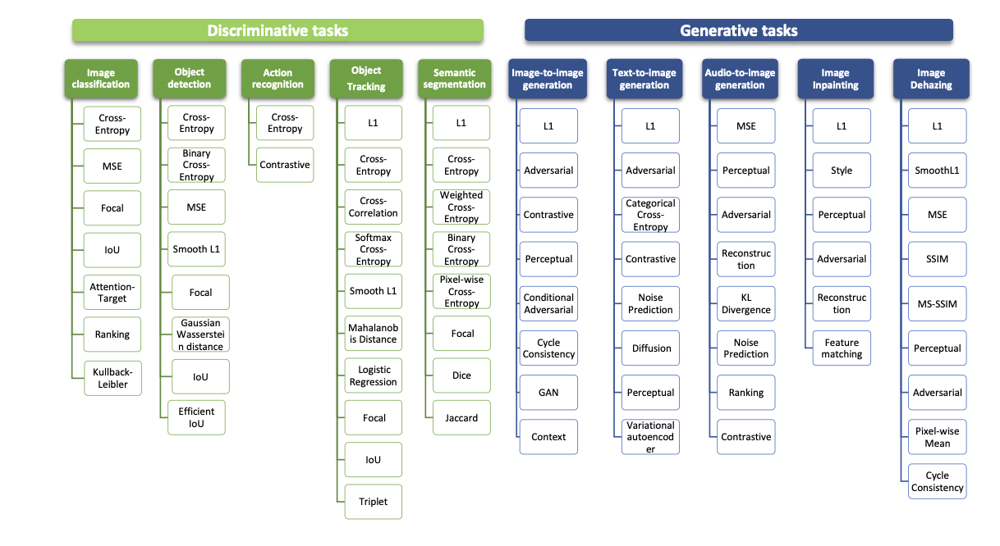

# Loss function for computer vision tasks

Computer vision tasks in deep learning require distinct approaches to measuring error, as both the nature of the data and the objectives vary considerably. These tasks can be broadly categorized into discriminative and generative tasks.

- `Discriminative tasks` include `classification`, `detection`, `recognition`, and `segmentation`. For example, 
  - `image classification` focuses on assigning the correct label to an image, while 
  - `object detection` extends this by also identifying object locations within the image. 
  - `Semantic segmentation` goes further by assigning a label to every pixel, requiring loss functions that promote `spatial coherence` and `fine-grained` accuracy.

- `Generative tasks` involve producing new data from various input modalities such as text, audio, or images. Image generation often relies on `adversarial frameworks`, where loss functions capture the trade-off between `realism` and `fidelity` by balancing `generated` and `real data`.

Beyond vision, other domains such as tabular data prediction and time series forecasting typically employ regression-oriented loss functions to handle continuous outputs and capture temporal dependencies.

In this section, we examine the diverse range of loss functions designed for these tasks, highlighting their suitability to specific requirements. A deeper understanding of these functions enables researchers to make informed choices in model selection, tuning, and improvement, thereby enhancing the effectiveness of predictive frameworks.

## Loss function per architecture

The **core role of a loss function** is the same across Convolutional Neural Networks (CNNs) and Vision Transformers (ViTs): to quantify the gap between predictions and true targets. This measure drives the optimization process, guiding weight updates through backpropagation so that models can systematically learn from errors. Both architectures can employ a wide range of loss functions depending on the task, ensuring flexibility across domains.

Despite this shared purpose, differences arise from their architectures and processing methodologies. CNNs operate directly on whole images, using convolutional filters to extract local features and build spatial hierarchies. ViTs, on the other hand, segment images into patches and depend on self-attention mechanisms to capture **global dependencies**. These distinct input representations influence not only how predictions are formed but also how loss functions are interpreted during training.

### **Loss Functions in Computer Vision Tasks**

| **Task**                      | **Loss Functions Used**                                                                                                            |
| ----------------------------- | ---------------------------------------------------------------------------------------------------------------------------------- |
| **Image Classification**      | Cross-Entropy, MSE, Focal, IoU, Attention-Target, Ranking, Kullback-Leibler                                                        |
| **Object Detection**          | Cross-Entropy, MSE, Smooth L1, Focal, Gaussian Wasserstein Distance, IoU, Efficient IoU                                            |
| **Action Recognition**        | Cross-Entropy, Contrastive                                                                                                         |
| **Object Tracking**           | Cross-Entropy, Cross-Correlation, Softmax Cross-Entropy, Smooth L1, Mahalanobis Distance, Logistic Regression, Focal, IoU, Triplet |
| **Semantic Segmentation**     | L1, Cross-Entropy, Weighted Cross-Entropy, Binary Cross-Entropy, Pixel-wise Cross-Entropy, Focal, Dice, Jaccard                    |
| **Image-to-Image Generation** | L1, Adversarial, Contrastive, Perceptual, Conditional Adversarial, Cycle Consistency, GAN, Context                                 |
| **Text-to-Image Generation**  | L1, Adversarial, Categorical Cross-Entropy, Contrastive, Noise Prediction, Diffusion, Perceptual, Variational Autoencoder          |
| **Audio-to-Image Generation** | MSE, Perceptual, Adversarial, Reconstruction, KL Divergence, Noise Prediction, Ranking, Contrastive                                |
| **Image Inpainting**          | L1, Style, Perceptual, Adversarial, Reconstruction, Feature Matching                                                               |
| **Image Dehazing**            | L1, Smooth L1, MSE, SSIM, MS-SSIM, Perceptual, Adversarial, Pixel-wise Mean, Cycle Consistency                                     |

Training dynamics also vary. CNNs are typically more stable, working well with smaller datasets and being less sensitive to hyperparameters. ViTs often demand larger datasets, careful tuning, and specialized initialization strategies, which can affect how effectively loss functions guide optimization. As a result, CNNs excel in tasks like **image classification** and **segmentation**, while ViTs are advantageous when capturing **long-range or global context** is crucial. Ultimately, the **choice and impact of a loss function** depend on the architecture’s characteristics and the specific nature of the task.

### **Comparison of Loss Functions in CNN-based and ViT-based Methods**

| **Aspect**                             | **CNN (Convolutional Neural Networks)**                                                 | **ViT (Vision Transformers)**                                                                                           |
| -------------------------------------- | --------------------------------------------------------------------------------------- | ----------------------------------------------------------------------------------------------------------------------- |
| **Input Processing**                   | Processes whole images using convolutional filters to capture **local features**.       | Segments images into patches, relying on **self-attention** for global dependencies.                                    |
| **Impact of Input Representation**     | Generates predictions based on **local patterns**, influencing how loss is interpreted. | Learns **global context**, leading to a different interpretation of loss.                                               |
| **Dataset Size**                       | Generally effective with **smaller datasets**.                                          | Often requires **larger datasets** for optimal performance.                                                             |
| **Sensitivity to Hyperparameters**     | Less sensitive to hyperparameters and initialization strategies.                        | More sensitive to hyperparameters, affecting optimization and training stability.                                       |
| **Performance on Tasks**               | Excels in **image classification** and **segmentation** tasks.                          | Performs better in tasks needing **global context** understanding (e.g., long-range dependencies).                      |
| **Selection of Loss Functions**        | Uses standard loss functions depending on the task (e.g., Cross-Entropy, Dice, IoU).    | Often selects loss functions that are optimized for **global feature learning** (e.g., attention-focused losses).       |
| **Overall Strategy of Loss Functions** | Guides optimization through **error quantification** consistently across tasks.         | Same purpose, but shaped by **architecture-specific characteristics** (attention, patch embeddings).                    |
| **Application Differences**            | Requires less specialized tailoring due to focus on **local features**.                 | Needs more **tailored approaches** for loss application, due to reliance on global context and architecture complexity. |

**Insight:**

* CNNs are robust, easier to optimize, and effective with smaller datasets, making their loss functions straightforward to apply.
* ViTs, by contrast, require more careful tuning and larger datasets; loss functions in ViTs often interact with the **global attention-based representation**, making them more sensitive but also more powerful in capturing holistic structures.

---

