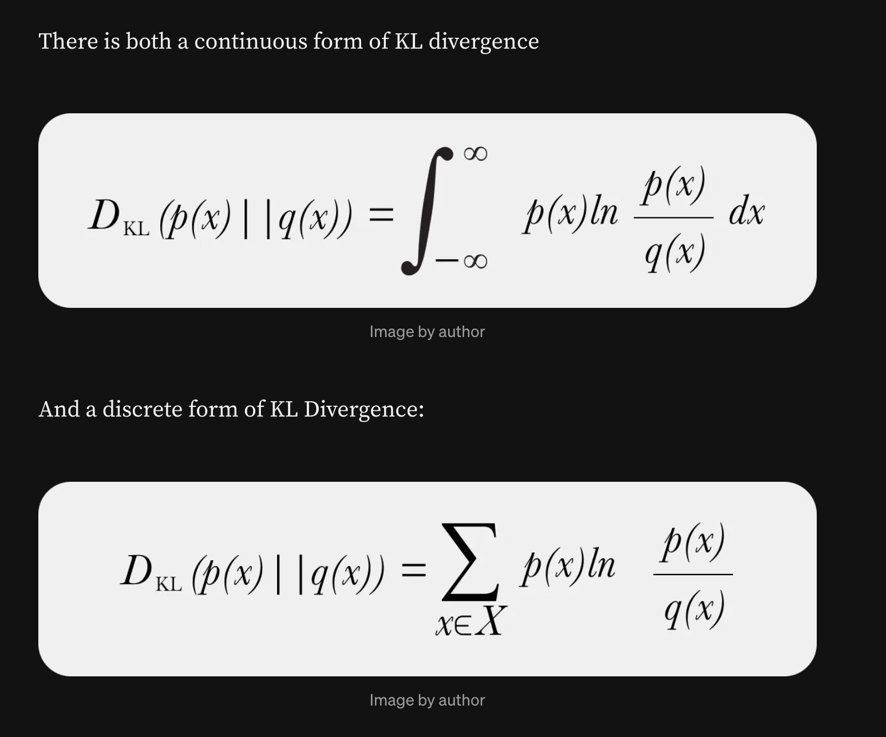

## **Image Classification**

In deep learning, loss functions play a central role in **image classification**, as they quantify how well a model’s predictions match the true labels. During training, these losses are used in **backpropagation** to compute gradients with respect to the model’s parameters, thereby guiding updates to minimize classification errors.

#### **Common Loss Functions**

* **Cross-Entropy Loss**

  * The most widely used for classification tasks.
  * Measures the performance of a model whose output is a probability distribution between `0` and `1`.
  * Encourages the network to assign `higher probabilities` to the `correct class`, improving performance in **multi-class settings**.

* **Mean Squared Error (MSE)**

  * Although primarily used for regression, MSE can also be applied in classification.
  * However, it is generally `less effective` than `cross-entropy` because it does not handle probability distributions as efficiently.

The choice of loss function directly impacts a model’s **ability to learn, generalize, and perform on unseen images**.

---

#### **Loss Functions in CNN-based Models**

Deep learning models for image classification often integrate different loss functions depending on their design:

* **VGG (Visual Geometry Group)** – Utilized **Euclidean loss** for training.
* **Inception** – Trained using **Cross-Entropy Loss**.
* **WideResNet** – Also employed **Cross-Entropy Loss**.

CNN-based architectures remain foundational backbones for various computer vision tasks.

---

#### **Loss Functions in Vision Transformers (ViTs)**

Vision Transformers (ViTs) also commonly rely on **Cross-Entropy Loss** for training. However, specialized tasks have introduced new loss formulations:

* **Private Inference ViTs** – Used **Cross-Entropy** with reduced-dimension attention and novel softmax approximations to improve efficiency.
  
* **Troj-ViT** – A ViT model designed for **backdoor attacks**, combining **Cross-Entropy Loss** and a custom **Attention-Target Loss** to manipulate outputs while preserving normal inference accuracy.
  
* **RepQ-ViT** – Addressed post-training quantization challenges by using **Ranking Loss** to preserve the relative order of attention scores before and after quantization, enhancing low-bit inference accuracy.

* **MGViT** – Applied **Cross-Entropy** and **Kullback-Leibler (KL) Divergence Loss** for optimization.
  
* **LFViT** – Leveraged **Cross-Entropy** and **KL Divergence Loss**, while reducing computational costs by processing low-resolution inputs first and focusing computation on selected regions, significantly improving throughput and FLOPs efficiency.

---

#### **Model–Loss Function Comparison**

| Task                 | Method            | Technique | Loss Function                    |
| -------------------- | ----------------- | --------- | -------------------------------- |
| Image Classification | VGG               | CNN       | Euclidean                        |
|                      | Inceptionv3       | CNN       | Cross-Entropy                    |
|                      | WideResNet        | CNN       | Cross-Entropy                    |
|                      | RNAViT            | CNN       | Cross-Entropy                    |
|                      | TrojViT           | ViT       | Cross-Entropy + Attention-Target |
|                      | RepQViT           | ViT       | Ranking                          |
|                      | MGViT             | ViT       | Cross-Entropy + Kullback-Leibler |
|                      | LFViT             | ViT       | Cross-Entropy + Kullback-Leibler |

---

#### **Key Insight**

While **Cross-Entropy Loss** remains the dominant choice for both `CNNs` and `ViTs` in classification, specialized architectures increasingly combine it with **auxiliary loss functions** (e.g., Attention-Target Loss, Ranking Loss, KL Divergence) to address **task-specific challenges** such as quantization, efficiency, and adversarial robustness.

---

# 1) Euclidean Loss (L2) / Mean Squared Error (MSE)

### **Definition**

Given predictions $`\hat{y}`$ and targets $`y`$:

* **Sum-of-squares (Euclidean/L2 loss):**

$$
\mathcal{L}_{\text{L2}}(\hat{y}, y) = \tfrac{1}{2}\sum_i (\hat{y}_i - y_i)^2
$$

* **Mean Squared Error (MSE):**

$`\mathcal{L}_{\text{MSE}}(\hat{y}, y) = \frac{1}{N}\sum_{i=1}^N (\hat{y}_i - y_i)^2`$

### **Gradients**

$`\frac{\partial \mathcal{L}_{\text{L2}}}{\partial \hat{y}_i} = \hat{y}_i - y_i,  \qquad  \frac{\partial \mathcal{L}_{\text{MSE}}}{\partial \hat{y}_i} = \frac{2}{N}(\hat{y}_i - y_i)`$

### **Intuition**

* Measures **straight-line (Euclidean) distance** between predictions and actual values.
* Errors are squared, so larger deviations are penalized more heavily.
* Encourages models to fit the **mean of the target distribution**, making it sensitive to outliers.

### **Practical Use Cases**

* **Regression tasks** (predicting continuous values like house prices, stock values).
* **Autoencoders** for reconstruction tasks, where pixel-wise similarity is important.
* **Computer vision** tasks involving dense predictions (e.g., depth estimation, super-resolution).

---

# 2) Cross-Entropy Loss

### **Definition**

Cross-Entropy measures the difference between a true distribution $p$ and a predicted distribution $`q`$.

* For a one-hot target $`y`$ (true class $`c`$):

$`\mathcal{L}_{\text{CE}}(y, q) = -\sum_{i=1}^K y_i \log q_i = -\log q_c`$

Where:

$$
q_i = \frac{e^{z_i}}{\sum_j e^{z_j}} \quad \text{(softmax probabilities from logits)}
$$

* **Binary cross-entropy (for $y \in \{0,1\}$):**

$$
\mathcal{L}_{\text{BCE}}(y, z) = -\big[y\log \sigma(z) + (1-y)\log(1-\sigma(z))\big]
$$

where $\sigma(z) = \frac{1}{1+e^{-z}}$.

### **Gradients**

* Multiclass case:

$$
\frac{\partial \mathcal{L}_{\text{CE}}}{\partial z_i} = q_i - y_i
$$

This simple gradient is one reason **softmax + CE** is so effective.

### **Intuition**

* Measures how “surprised” the model is by the correct label.
* If the model assigns a high probability to the correct class, the loss is small.
* Strongly penalizes **confident wrong predictions**, which encourages better class separation.

### **Practical Use Cases**

* **Classification tasks** (image classification, text classification, speech recognition).
* **Multilabel problems** with binary cross-entropy (e.g., tagging multiple objects in one image).
* **Language models** where predicting the next word requires probability distributions.
* Used in almost all **deep classification networks** (CNNs, RNNs, Transformers).

---

# 3) Kullback–Leibler (KL) Divergence

KL divergence is a non-symmetric metric that measures the `relative entropy` or difference in `information` represented by `two distributions`. It can be thought of as measuring the distance between two data distributions showing how different the two distributions are from each other.

### **Definition**

KL Divergence quantifies how one probability distribution $p$ diverges from another distribution $q$:

$$
D_{\mathrm{KL}}(p \| q) = \sum_i p_i \log\frac{p_i}{q_i}
$$

Where $p$ is the true distribution and $q$ is the predicted distribution.

### **Relation to Cross-Entropy**

$$H(p, q) = H(p) + D_{\mathrm{KL}}(p \| q)$$

When $p$ is fixed (targets), minimizing cross-entropy is equivalent to minimizing KL divergence.

### **Gradients**

$$
\frac{\partial D_{\mathrm{KL}}(p \| q)}{\partial z_i} = q_i - p_i
$$

(same as cross-entropy, but $p$ need not be one-hot—it can be a soft distribution).

### **Intuition**

* Measures how much information is “lost” when $q$ approximates $p$.
* If $p$ and $q$ are identical, KL divergence is zero.
* Sensitive to cases where $q$ assigns low probability to events where $p$ has high probability.

### **Practical Use Cases**

* **Knowledge distillation**: student networks learn from teacher networks using soft labels.
* **Variational Autoencoders (VAEs)**: regularizes latent space by minimizing KL between approximate posterior and prior.
* **Reinforcement Learning**: policy optimization algorithms (e.g., PPO) constrain updates via KL divergence.
* **Language models and generative tasks**: matching distributions of predicted tokens with true distributions.

### **How Is KL Divergence Used in Model Monitoring?**

In model monitoring, `KL divergence` is used to monitor production environments, specifically around feature and prediction data. KL Divergence is utilized to ensure that input or output data in production doesn’t drastically change from a baseline. The baseline can be a training production window of data or a training or validation dataset.

`Drift monitoring` can be especially useful for teams that receive delayed ground truth to compare against production model decisions. These teams can rely on changes in prediction and feature distributions as a proxy for performance.

KL divergence is typically applied to each feature independently; it is not designed as a covariant feature measure but rather a metric that shows how each feature has diverged independently from the baseline values.

More: [Understanding KL Divergence](https://medium.com/data-science/understanding-kl-divergence-f3ddc8dff254)

---

# **Summary Table**

| Loss Function          | Formula                          | Intuition                                                                                     | Practical Use Cases                                 |
| ---------------------- | -------------------------------- | --------------------------------------------------------------------------------------------- | --------------------------------------------------- |
| **Euclidean (L2/MSE)** | $\tfrac{1}{N}\sum (\hat{y}-y)^2$ | Measures squared distance; penalizes large errors more                                        | Regression, autoencoders, dense predictions         |
| **Cross-Entropy**      | $-\sum y \log q$                 | Penalizes wrong/confident predictions; measures alignment of predicted and true distributions | Classification, multilabel problems, NLP, CV        |
| **KL Divergence**      | $\sum p \log \frac{p}{q}$        | Measures how much predicted distribution diverges from true distribution                      | Knowledge distillation, VAEs, RL, generative models |

---

