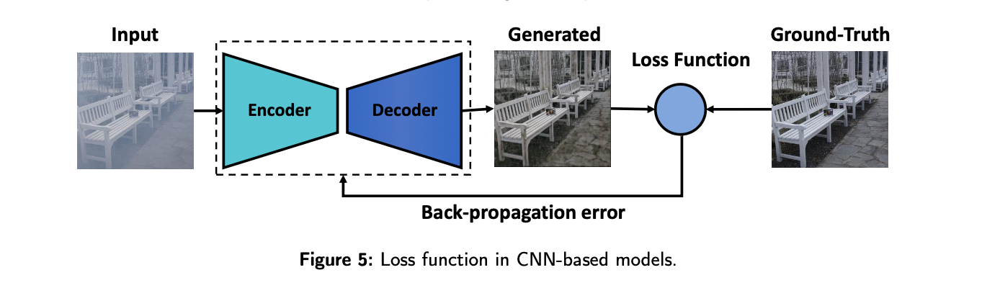

# Generative tasks

**fig.1:** Loss function in CNN-based models

Generative tasks in computer vision focus on enabling models to create new visual content or transform existing images by learning the underlying distribution of data. The aim is to produce outputs that are both realistic and semantically meaningful, whether through synthesizing entirely new images, modifying forms, or generating variations that enrich data diversity. These tasks are central to modern computer vision because they move beyond recognition and classification into the realm of creation, where machines attempt to mimic the richness of visual data found in the real world.

The field has been driven forward by deep learning architectures such as 
- `Convolutional Neural Networks`, 
- `Generative Adversarial Networks`, 
- `Variational Autoencoders`, 
- `Vision Transformers`, and more recently, 
- `Diffusion Models`. 

Each of these frameworks contributes different strengths:

- CNNs excel at capturing spatial structure, 
- GANs foster realism through adversarial training, 
- VAEs allow controlled sampling from latent spaces, 
- transformers capture global dependencies for structured image synthesis, and 
- diffusion models iteratively refine noise into highly detailed images. 

Together, these architectures illustrate how generative methods have evolved from pixel-level reconstructions to complex, multimodal creations that can rival human-generated visuals.

**fig.2:** Loss function in GAN-based models

A central element in training generative models lies in the design of loss functions, which determine how closely outputs align with the intended targets. Pixel-wise losses such as `L1` and `L2` ensure low-level consistency, while perceptual losses encourage semantic fidelity by comparing higher-level feature representations. Adversarial losses, as used in GANs, drive models toward realism by challenging them to fool a discriminator network. In multimodal settings, specialized similarity losses ensure that generated visuals meaningfully correspond to text or audio inputs. By combining and refining these loss metrics, generative systems achieve a balance of fidelity, realism, and semantic alignment. These advances power applications such as 
- `image-to-image translation`, 
- `text-to-image synthesis`, 
- `audio-to-image visualization`, and 
- `creative content generation`, 

ultimately expanding the role of computer vision into artistic, practical, and multimodal domains.

---

## **Generative Tasks in Computer Vision**

Generative tasks focus on creating **new visual content** or transforming existing images by learning the **underlying data distribution**. The aim is to produce outputs that look realistic, diverse, and semantically meaningful.

### **Core Architectures**

* **CNNs** → Extract spatial features for structured generation.
* **GANs** → Generator–Discriminator game for highly realistic outputs.
* **VAEs** → Latent space modeling for controlled, diverse generation.
* **Vision Transformers (ViTs)** → Self-attention for capturing global dependencies.
* **Diffusion Models** → Iterative noise-to-image synthesis, producing detailed, photorealistic images.

### **Goals**

* Mimic real-world data distributions.
* Generate **indistinguishable synthetic images**.
* Enable **creativity, augmentation, and multimodal generation** (image, text, audio).

### **Loss Functions in Generative Models**

Losses define what "good generation" means and directly shape image realism and alignment.

* **Pixel-wise Losses (L1, L2/MSE):** Ensure low-level fidelity; useful for reconstruction and image-to-image tasks.
* **Perceptual Losses:** Compare feature representations from pretrained networks; preserve semantic structure.
* **Adversarial Losses:** Drive generators to produce realistic images that can fool a discriminator (GANs).
* **Text-Image Similarity Losses:** Align visuals with textual descriptions for accurate multimodal generation.
* **Audio-Image Losses:** Ensure images reflect meaningful audio-visual correspondence.

### **Applications**

* **Image-to-Image:** Super-resolution, style transfer, inpainting.
* **Text-to-Image:** Generating images from natural language prompts.
* **Audio-to-Image:** Visualizing sound or creating multimodal art.
* **Data Augmentation:** Synthesizing diverse datasets.
* **Creative Media:** Art, design, entertainment, content creation.

### **Key Insight**

The **choice of loss function** is as critical as the architecture:

* **Pixel-wise losses** ensure fidelity.
* **Perceptual and adversarial losses** ensure realism.
* **Cross-modal losses (text/audio-image)** ensure semantic alignment.

Together, these losses guide generative models to produce **visually convincing, semantically accurate, and diverse outputs**.

---

# **Description of Loss Functions Used in Generative Tasks**

| **Loss Function**                   | **Description**                                                                                                                                |
| ----------------------------------- | ---------------------------------------------------------------------------------------------------------------------------------------------- |
| **MSE Loss**                        | Measures the mean squared difference between predicted and actual image values, ensuring pixel-level accuracy.                                 |
| **L1 Loss**                         | Measures the mean absolute difference between predicted and actual pixel values, encouraging accuracy in image generation.                     |
| **Categorical Cross-Entropy Loss**  | Calculates the difference between predicted class distributions and true labels, typically used in classification contexts for image features. |
| **Style Loss**                      | Evaluates the similarity in style between the generated image and a reference image, focusing on texture and color distribution.               |
| **Reconstruction Loss**             | Assesses how well the generated image matches the input information, ensuring important details are preserved.                                 |
| **Adversarial Loss**                | Challenges the generator to produce realistic images by evaluating its outputs against those of a discriminator.                               |
| **Perceptual Loss**                 | Evaluates image quality based on high-level features from pre-trained networks, emphasizing perceptual similarity rather than pixel accuracy.  |
| **Contrastive Loss**                | Ensures that image representations align closely with text embeddings, useful in joint embedding spaces.                                       |
| **Variational Autoencoder Loss**    | Combines reconstruction loss with a regularization term to ensure meaningful latent spaces, fostering diverse image outputs.                   |
| **Conditional Adversarial Loss**    | Guides the generator by conditioning it on extra information (e.g., class labels) to produce images relevant to that context.                  |
| **Cycle Consistency Loss**          | Aims to retain content and structure across transformations between domains, enforcing consistency in generated outputs.                       |
| **Context Loss**                    | Focuses on preserving the semantic context and spatial structure of images during generation to ensure contextual accuracy.                    |
| **KL Divergence Loss**              | Measures how one probability distribution diverges from another, often used in scenarios involving distribution matching.                      |
| **Noise Prediction Loss**           | Focuses on predicting and minimizing noise in the generated output, improving the quality of the final image.                                  |
| **Diffusion Noise Prediction Loss** | Used in diffusion models to predict noise and refine images iteratively, enhancing generation quality.                                         |
| **Diffusion Loss**                  | Related to diffusion processes, measures the difference between image outputs at different steps in progressive refinement.                    |

---

 