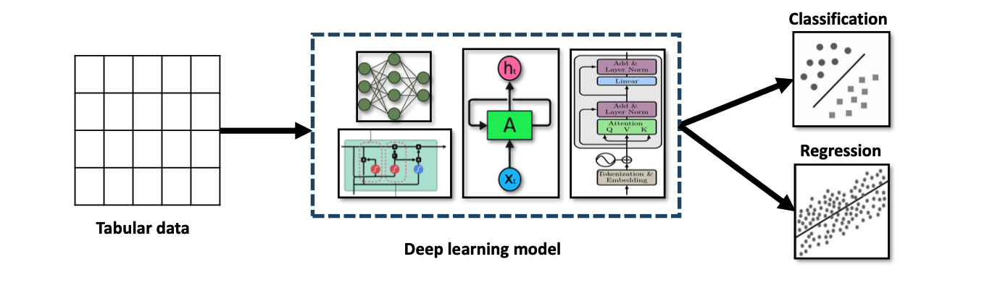

# **Loss Functions for Tabular Data Prediction**

## **Overview**

Tabular data prediction is a core task in machine learning, involving structured datasets organized in rows and columns. Each row represents an observation, and each column represents features or variables. This type of data is common in domains such as **finance, healthcare, marketing, and logistics**.

The goal is to train models on historical data to learn patterns and relationships that can generalize to new, unseen data. Predictions may involve:

* **Regression tasks**: predicting continuous values (e.g., price, risk scores).
* **Classification tasks**: predicting discrete categories (e.g., loan approval, disease diagnosis).

Selecting the right **loss function** is central to model performance, as it directs optimization and parameter updates during training.

## **Common Loss Functions for Tabular Data**

### **Regression Tasks**

* **Mean Squared Error (MSE)**: Measures squared differences between predictions and actual values. Sensitive to outliers but widely used due to mathematical convenience.
* **Mean Absolute Error (MAE/L1)**: Measures absolute differences; more robust to outliers than MSE.

### **Classification Tasks**

* **Binary Cross-Entropy (Log Loss)**: Used for binary classification, penalizes incorrect probability predictions.
* **Categorical Cross-Entropy**: Extends BCE for multi-class classification.
* **Gini Impurity**: Used in tree-based models for classification to measure node purity.

## **Traditional Machine Learning Models and Loss Functions**

| **Method**                  | **Task**                                    | **Common Loss Functions**                                |
| --------------------------- | ------------------------------------------- | -------------------------------------------------------- |
| **Linear Regression**       | Regression                                  | MSE                                                      |
| **Decision Trees**          | Regression, Classification                  | MSE (regression), Gini Impurity (classification)         |
| **Random Forest**           | Ensemble of Trees                           | Average MSE (regression), Cross-Entropy (classification) |
| **Gradient Boosting (GBM)** | Sequential ensemble                         | MSE (regression), Log Loss (classification)              |
| **XGBoost**                 | Scalable GBM variant                        | MSE, Log Loss                                            |
| **LightGBM**                | Histogram-based boosting                    | MSE, Log Loss                                            |
| **CatBoost**                | Gradient boosting with categorical handling | MSE, Log Loss                                            |

## **Deep Learning Models for Tabular Data**

| **Model**                                      | **Description**                                                         | **Loss Functions**                     |
| ---------------------------------------------- | ----------------------------------------------------------------------- | -------------------------------------- |
| **Deep Neural Networks (DNN)**                 | Multi-layer networks modeling nonlinear feature interactions.           | MSE (regression), BCE (classification) |
| **XGBoost with Neural Nets**                   | Combines boosting with neural principles for stronger tabular learning. | MSE, Log Loss                          |
| **TabNet**                                     | Attention-based architecture for tabular tasks.                         | Cross-Entropy, MSE                     |
| **Entity Embeddings of Categorical Variables** | Learns dense vector representations of categorical data.                | Cross-Entropy                          |
| **AutoGluon**                                  | Automated ensemble of deep learning models for tabular data.            | Multi-task Losses                      |
| **CatBoost (Deep Boosted)**                    | Gradient boosting optimized for categorical features.                   | Log Loss, MSE                          |
| **LightGBM (Enhanced)**                        | Efficient gradient boosting with histogram-based methods.               | Log Loss, MSE                          |

## **Key Insights**

1. **Regression vs. Classification**: MSE/MAE dominate regression, while Cross-Entropy and Log Loss dominate classification.
2. **Tree-based Models**: Often combine impurity-based losses (like Gini) with MSE/Log Loss for flexibility.
3. **Boosting Frameworks**: XGBoost, LightGBM, and CatBoost emphasize efficiency and robustness, tailoring loss functions to large-scale tabular datasets.
4. **Deep Learning for Tabular Data**: TabNet and entity embeddings show how neural architectures leverage loss functions for richer representation learning.
5. **AutoML Approaches**: Frameworks like AutoGluon highlight the move toward multi-task loss functions for more robust, general-purpose solutions.

---

## **Summary of Tabular Data Prediction Methods and Loss Functions**

| **Type of Data** | **Task**                   | **Class/Reg**     | **Technique**                  | **Loss Function**                                        |
| ---------------- | -------------------------- | ----------------- | ------------------------------ | -------------------------------------------------------- |
| Tabular Data     | Regression                 | DNN               | Deep Neural Network            | Mean Squared Error (MSE)                                 |
| Tabular Data     | Classification             | DNN               | Deep Neural Network            | Binary Cross-Entropy                                     |
| Tabular Data     | Classification             | ANN               | XGBoost                        | Log Loss, MSE                                            |
| Tabular Data     | Classification, Regression | Transformer       | TabNet                         | Softmax Cross-Entropy (Classification), MSE (Regression) |
| Tabular Data     | Classification             | ANN               | Entity Embeddings (Din et al.) | Cross-Entropy                                            |
| Tabular Data     | Classification, Regression | ANN               | AutoGluon-Tabular              | Log Loss, MSE                                            |
| Tabular Data     | Classification, Regression | Gradient Boosting | CatBoost                       | Log Loss, Zero-One Loss                                  |
| Tabular Data     | Classification             | Decision Tree     | LightGBM                       | Various Loss Functions (e.g., Log Loss, MSE)             |

---

