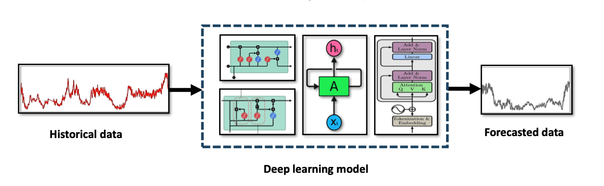

# Loss Functions for Time Series Forecasting

Time series forecasting is a critical task across domains such as finance, healthcare, energy, and climate science, where the goal is to predict future values based on past observations. Deep learning models like **RNNs, LSTMs, GRUs, CNN hybrids, and Transformers** have proven powerful in capturing both short- and long-term dependencies in sequential data.

A key factor in training these models is the choice of **loss function**, which defines how prediction errors are quantified and minimized. For regression tasks (e.g., predicting stock prices), **Mean Squared Error (MSE)** and **Mean Absolute Error (MAE)** are the most common. For uncertainty-aware forecasting (e.g., probabilistic weather forecasting), **Negative Log-Likelihood** and **Quantile Loss** are used to provide prediction intervals. For classification-like time series tasks (e.g., survival prediction, anomaly detection), **Cross-Entropy** and **Weighted Cross-Entropy** play a central role.

### Summary of Time Series Forecasting Methods, Loss Functions, and Application Domains

| **Method**           | **Technique**    | **Loss Function**       | **Application Domain**                       |
| -------------------- | ---------------- | ----------------------- | -------------------------------------------- |
| N-BEATS \[159]       | ANN              | MSE                     | Univariate forecasting (finance, retail)     |
| DeepAR \[160]        | RNN              | Negative Log-Likelihood | Demand forecasting, probabilistic forecasts  |
| Lim et al. \[158]    | Transformer (TR) | MSE or Huber Loss       | Stock prediction, weather, energy            |
| SCINet \[161]        | CNN              | L1                      | Long-term temporal dynamics, multiscale TS   |
| Informer \[162]      | Transformer (TR) | MSE                     | Long sequence forecasting (LSTF)             |
| FEDformer \[163]     | Transformer (TR) | MSE                     | Seasonal-trend time series (finance, energy) |
| Salman et al. \[164] | CNN, LSTM, TR    | MSE                     | Solar power forecasting, renewable energy    |
| RB-GRU-CNN \[165]    | CNN, GRU         | Cross-Entropy           | ECG prediction, healthcare                   |
| Huang et al. \[166]  | Entropy Features | Cross-Entropy           | Neurological signals, medical TS             |
| King et al. \[167]   | CNN, RNN         | Cross-Entropy           | Heat exchanger temperature forecasting       |

Recent advancements, particularly with **Transformer-based architectures (Informer, FEDformer, SCINet)**, emphasize scalability to long sequences and capture of global dependencies, while leveraging robust loss functions like **MSE, L1, and Huber Loss**. Hybrid models that combine CNNs, RNNs, and Transformers further refine feature extraction and forecasting precision, sometimes adopting **task-specific losses** (e.g., entropy-based losses for medical data).

### Summary of Time Series Forecasting Methods and Loss Functions

| **Type of Data Task**            | **Technique/Architecture** | **Loss Function(s)**    | **Notes / Applications**                                                            |
| -------------------------------- | -------------------------- | ----------------------- | ----------------------------------------------------------------------------------- |
| **Regression (forecasting)**     | RNN, LSTM, GRU             | MSE, MAE                | Standard for continuous value prediction (e.g., stock prices, energy demand).       |
| **Probabilistic Forecasting**    | DeepAR (Amazon)            | Negative Log-Likelihood | Produces full predictive distributions; useful in risk-sensitive applications.      |
| **Univariate Forecasting**       | N-BEATS                    | MSE                     | Specializes in trend + seasonal decomposition for single-variable series.           |
| **Transformer-based Models**     | Transformers (general)     | MSE, Huber Loss         | Self-attention enables capturing long-term dependencies; used in climate, finance.  |
| **Recursive downsampling**       | SCINet                     | L1 Loss                 | Models complex multi-resolution temporal dynamics; efficient for large-scale data.  |
| **Long-sequence forecasting**    | Informer                   | MSE                     | ProbSparse self-attention allows scaling to very long input sequences.              |
| **Seasonal-Trend Decomposition** | FEDformer                  | MSE                     | Combines Transformer with seasonal-trend decomposition; excels in periodic signals. |
| **Hybrid CNN-LSTM-Transformer**  | CNN–LSTM–TF Hybrid         | MSE                     | Used in solar energy forecasting; strong performance in multi-feature time series.  |
| **Medical Survival Prediction**  | RB-GRU-CNN Hybrid          | Cross-Entropy           | ECG-based survival prediction; loss reflects classification over risk categories.   |
| **Neurological Time Series**     | Entropy-based pipeline     | Cross-Entropy           | Captures uncertainty/statistical structure in EEG and neurological signals.         |
| **Thermal/Engineering Data**     | CNN-RNN Hybrid (BHE)       | Weighted Cross-Entropy  | Improves forecasting fluid temperature in Borehole Heat Exchangers.                 |
| **Uncertainty Forecasting**      | Quantile Regression Models | Quantile Loss           | Provides confidence intervals and captures asymmetric risks (e.g., finance).        |

### Key Insights

1. **Regression-focused losses** (MSE, MAE, L1, Huber) dominate traditional forecasting tasks where the goal is accurate point predictions.
2. **Probabilistic losses** (Negative Log-Likelihood, Quantile Loss) are crucial for applications that demand **uncertainty-aware predictions** such as finance, risk management, and meteorology.
3. **Classification-style losses** (Cross-Entropy, Weighted Cross-Entropy) appear in **healthcare and anomaly detection** time series, where outputs are categorical rather than continuous.
4. **Transformer-based approaches** (Informer, FEDformer, SCINet) increasingly rely on **MSE, L1, and Huber Loss**, reflecting their ability to model long horizons with strong temporal dependencies.
5. **Hybrid models** (CNN-LSTM-Transformer) show state-of-the-art performance by combining **local feature extraction (CNNs)**, **temporal memory (RNNs/GRUs/LSTMs)**, and **global attention (Transformers)**, typically with **MSE-based optimization**.

---

**Note:** **Refer to the "Loss function for tabular data prediction" and "Loss function for computer vision tasks" files for similar structured content in other domains. As well as the code implementations in the "code" folder.**

